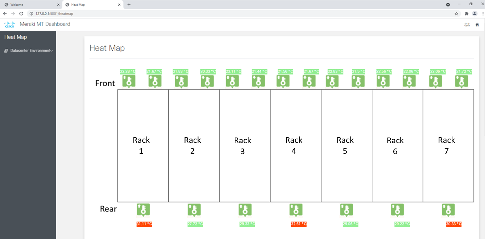
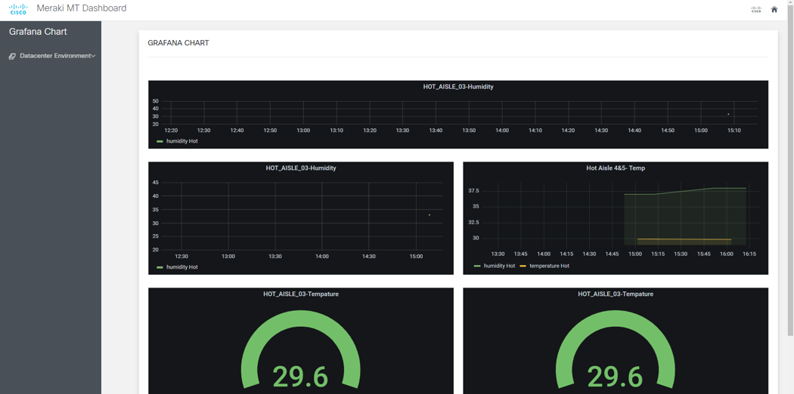
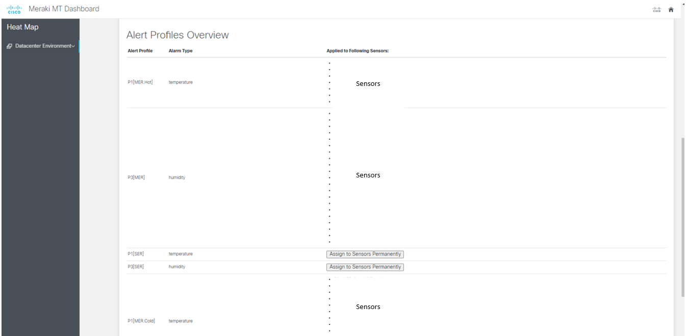

## Meraki Analytics Dashboard

## Contacts
* Eda Akturk
* Jara Osterfeld

## Solution Components
* Docker  
    - Grafana
    - Influx DB
* Python 3.8
*  Cisco Meraki
    - [API Documentation](https://developer.cisco.com/meraki/api-v1/)


## Solution Overview
The solution creates a web application that allows the users to view details and graphs related to meraki sensors.

For screenshots of the application please view "Screenshots" below.

## Setup

1. Clone the repository.
   ```
   git clone (repo)
   ```

2. Open the `config.py` file. Fill in the following information:
   ```
    meraki_api_key = " "
    network_id = " "
    temperature_sensors = ["xx","xx","xx"]

    ASHRAE_low = # integer to determine below which temperature (in °C) the tag should be labeled blue
    ASHRAE_high = # integer to determine above which temperature (in °C) the tag should be labeled red

    SENSOR_MAPPING = [
        {
            "name": "", # name of the sensor
            "serial": "", # serial number of the sensor
            "type": "" # type of sensor, e.g. temperature
        } # copy this dictionary for as many sensors there are
    ]

   ```
3. Add the sensor mapping ids to templates/dc_heatmap.html. Change the "rack_id1" to the rack names.

 ```
<span style="margin:0px 0px 0px 120px;"><a id="rack_id1" href="{{ url_for('heatmap', sensor='rack_id1') }}" style="color:white;">{{ temp_values["rack_id1"] }}</a></span>
   ```
#### Grafana and Influx DB Setup
4. Go to the directory where the `docker-compose.yml` file is located, pull and
 build all images of the container:
   ```
    docker-compose build
   ```

5. Start the containers in the background (-d). Grafana and InfluxDB will
   be automatically configured.
   ```
    docker-compose up -d
   ```

6. Setup Influx DB. Go to "http://localhost:8086/" and enter the username, password, organization and bucket information.

7. Get your Influx DB token from http://localhost:8086/orgs/{org_id}/load-data/token (Data --> Tokens).

8. Login to your Grafana Dashboard from http://localhost:3000/login. Enter the username/password(admin/admin). You will be required to set a new password.

####  Web app Setup
9. Add your Influx db token to Grafana datasources (Datasources --> InfluxDB --> token). Click Save&Test to check if your Influx DB and Grafana Dashboard are connected.

10. Add your Influx db token to the config.py file.
   ```
    token = " "
   ```

11. Go to your app folder and install the libaries for the app code.
    ```
    pip install -m requirements.txt
    ```

12. Go to you Grafana dashboard and get URL link to add the grafana tables to the web app .
The URL link can be found at: Dashboard --> Share Dashboard or Panel --> Link URL

13. Add the link url to  templates/grafana.html file

14. Run the meraki_connector file to add data in your Influx DB Bucket.
   ```
    python data_collector.py
   ```  
15. Run your web application:
   ```
    python flaskApp.py
   ```  

# Screenshots





### LICENSE

Provided under Cisco Sample Code License, for details see [LICENSE](LICENSE.md)

### CODE_OF_CONDUCT

Our code of conduct is available [here](CODE_OF_CONDUCT.md)

### CONTRIBUTING

See our contributing guidelines [here](CONTRIBUTING.md)

#### DISCLAIMER:
<b>Please note:</b> This script is meant for demo purposes only. All tools/ scripts in this repo are released for use "AS IS" without any warranties of any kind, including, but not limited to their installation, use, or performance. Any use of these scripts and tools is at your own risk. There is no guarantee that they have been through thorough testing in a comparable environment and we are not responsible for any damage or data loss incurred with their use.
You are responsible for reviewing and testing any scripts you run thoroughly before use in any non-testing environment.
